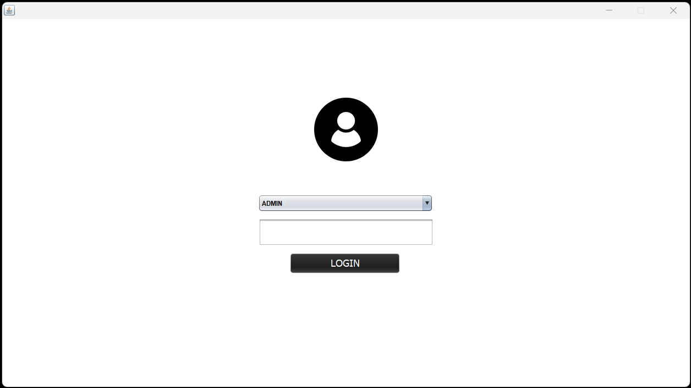
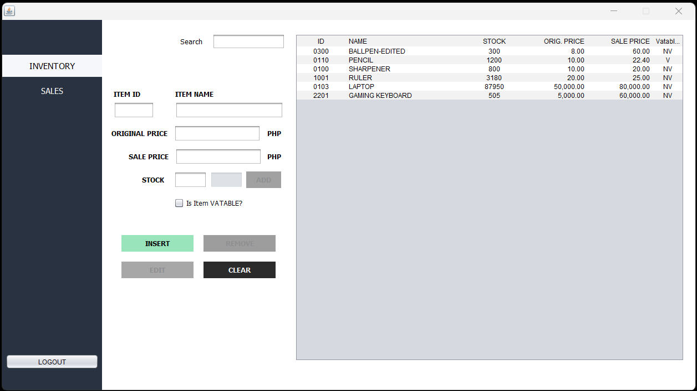
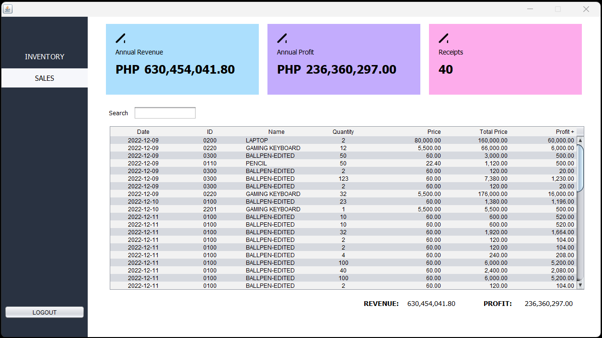
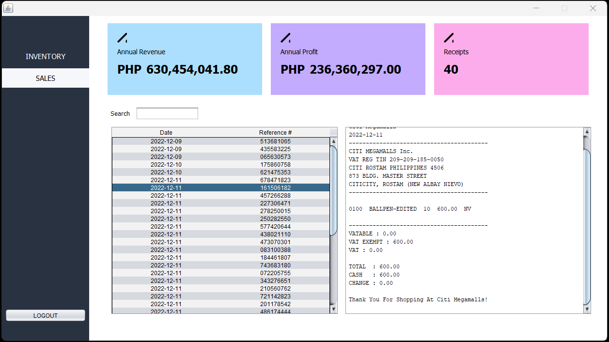
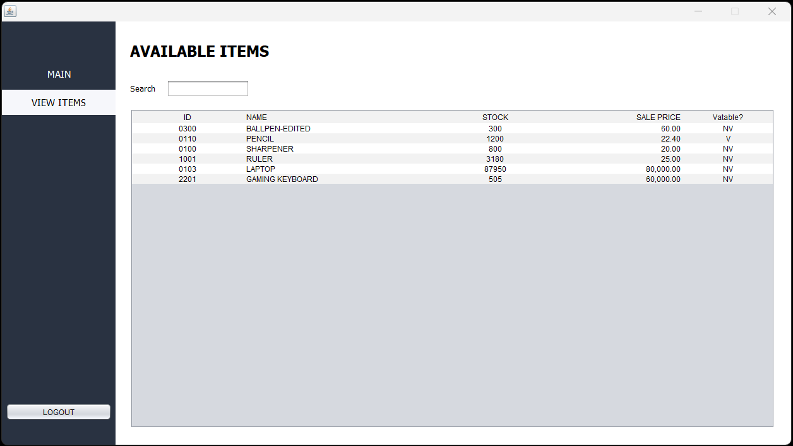
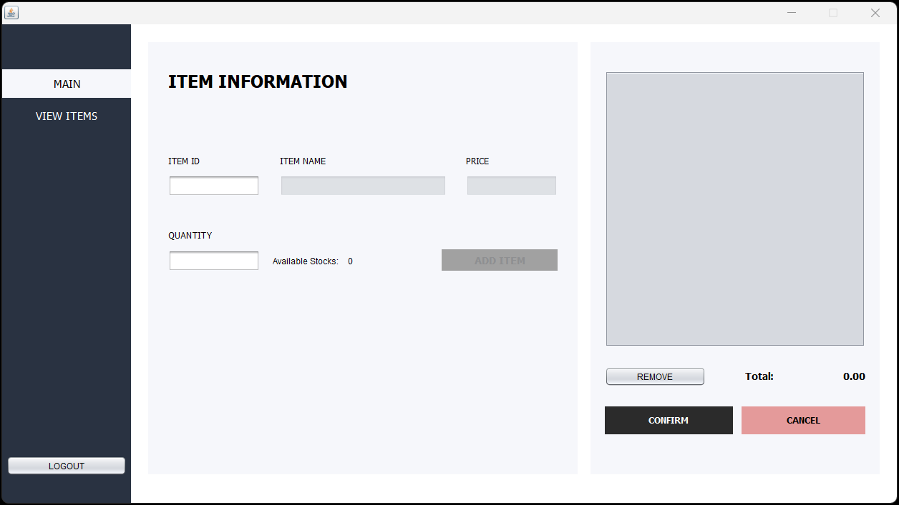

# Inventory System
### Language: Java
### IDE: Netbeans

Source code (SC) is found at the folder named "src" -> "Project Package".
Main Source Code: Main_Frame.java    

ADMIN - Log In View    

ADMIN - Inventory View    

    
ADMIN - Sales View    

    
ADMIN - Sales View with Receipt    

    
USER - Items View    

USER - Main View    

    
Programmed by:
HibernatedApe / Yukode